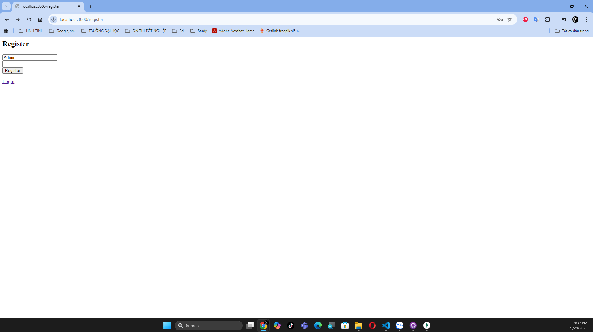
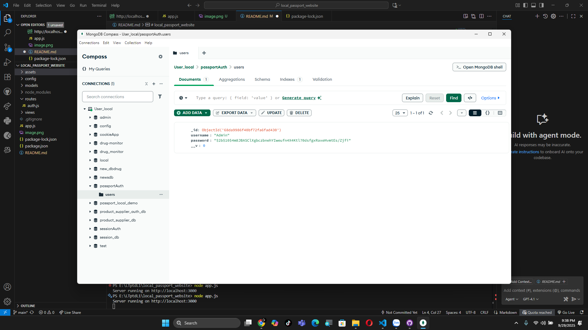
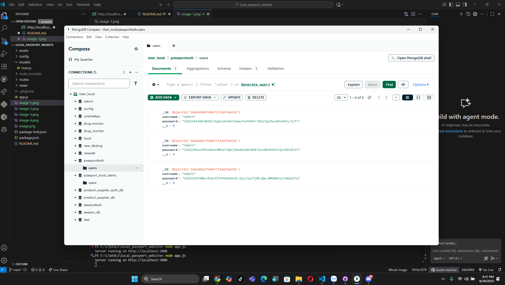
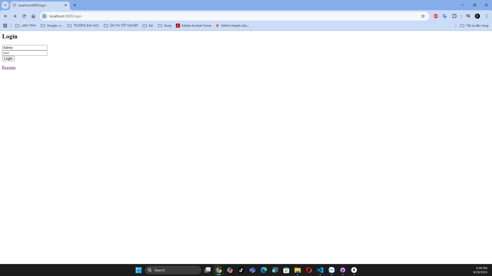
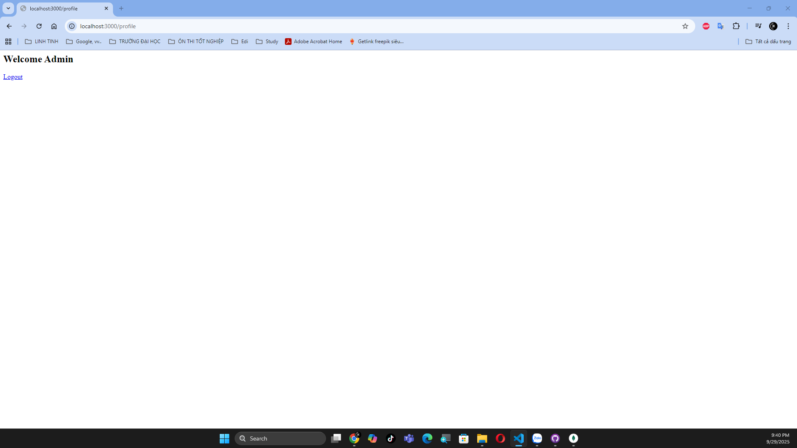
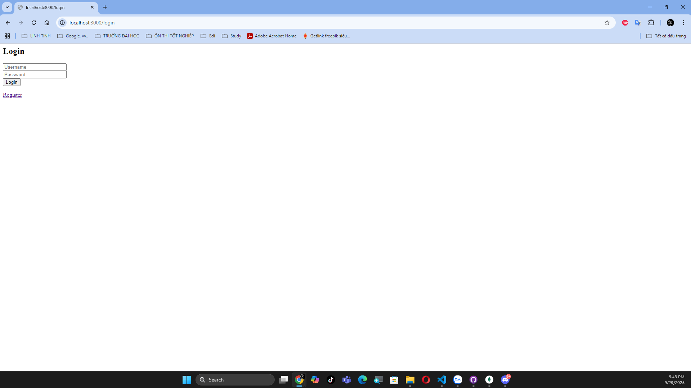

# 🌐 Local Passport Website

---

## 📑 Quy trình demo

### 📝 Đăng ký tài khoản
- Người dùng thực hiện đăng ký:  
  

- Kiểm tra CSDL sau khi đăng ký:  
  

---

### ⚠️ Đăng ký tài khoản trùng lặp
- Hệ thống vấn cho đăng ký trùng lặp
  

---

### 🔐 Đăng nhập tài khoản
- Người dùng đăng nhập thành công:  
  

---

### 👤 Giao diện sau khi đăng nhập
- Trang hiển thị thông tin profile:  
  

---

### 🚪 Logout
- Khi logout, hệ thống tự động trả về trang Login:  
  

---

## 📌 Tổng kết
- **Passport.js** giúp xác thực username/password trong ứng dụng web.  
- Chưa đăng nhập thực hiện vào profile tự dộng được chuyển hướng vào login
- Khi đăng ký, tài khoản mới được lưu vào CSDL. Vẫn cho phép đăng ký trùng
- Khi đăng nhập, Passport tạo session và cookie để duy trì đăng nhập.  
- Nếu đăng nhập khi dữ liệu trong CSDL trùng lặp, tự động hướng đến giá trị so sánh đầu tiên
- Logout sẽ xóa session và điều hướng người dùng về trang login.  

✍️ *Demo phục vụ học tập về Authentication*
